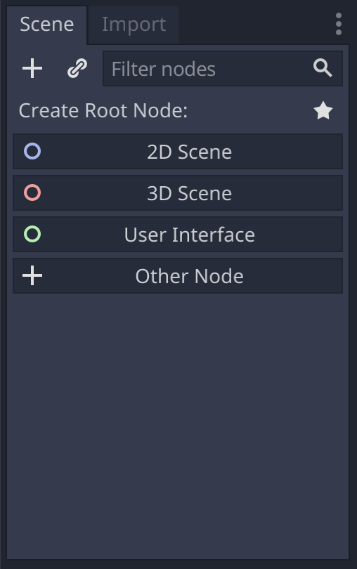
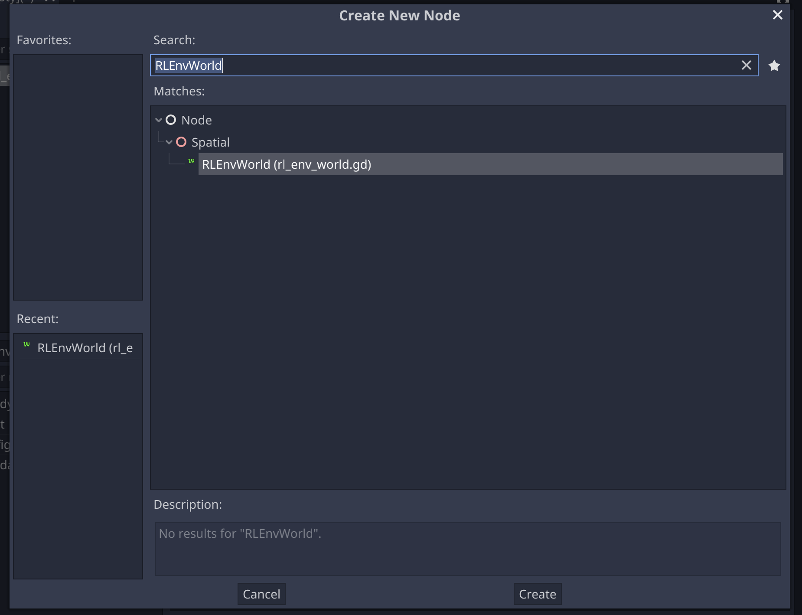
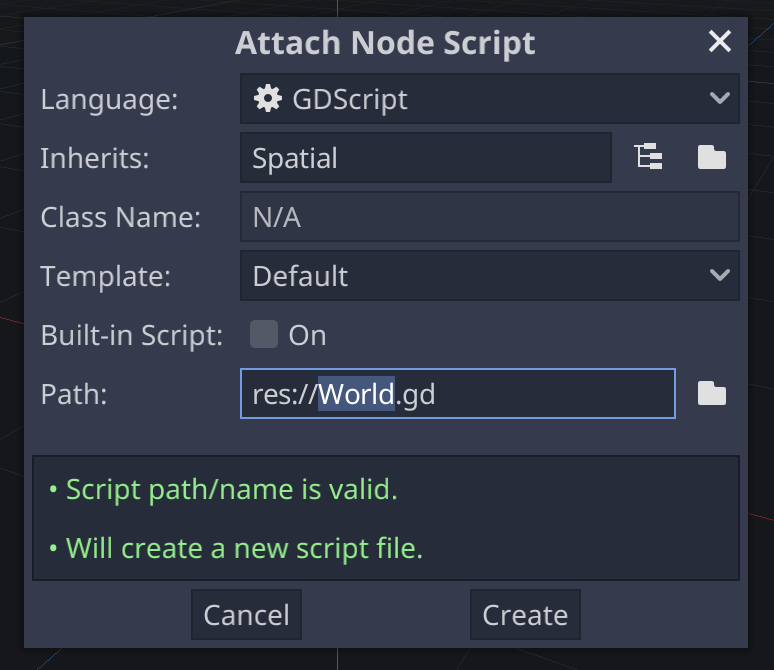

Creating Godot Application
==========================

In this step, we will create our 3D-environment in Godot. 

Download predefined assets to create the environment from `here <https://drive.google.com/drive/folders/11WHN71MlsSQczIingNdGwSnW6G2fU5sU?usp=drive_link>`_ 
and copy-paste the ``assets`` directory into your Godot project directory. 

.. note::
    We exclude the process of the assets creating from the tutorial scope. 

Creating World
--------------

Now we are going to create a *World*. 
In **Godot Gym API** *World* (``RLEnvWorld`` node) is assumed to be everything in the environment 
the agent can interact with. For this tutotial, the *World* is a room with an apple inside. 
The apple can be located anywhere inside the room and its location is assigned on the *World* reset.

1. Create a new scene with ``World.tscn`` name.

2. In scene tree click *Other node*.

2. Search for ``RLEnvWorld`` node and create it.

3. Rename the node. In this tutorial, the node name is *World*.

4. Drag and drop ``Room.tscn`` and ``Apple.tcsn`` from ``assets`` directory to *World* node children. 

5. Detach *World* node default script.

.. image:: ./images/detach_rl_env_script.png
   :width: 200

5. Add new script and save it with ``World.gd`` name.

.. image:: ./images/attach_rl_env_script.png
   :width: 200

6. Define *World* node behaviour in the node script as follows:

.. code-block:: gdscript

    extends RLEnvWorld

    onready var apple = $Apple
    onready var apple_caught: bool = false

    func _ready():
        apple.get_node("AppleCatchArea").connect("body_entered", self, "_on_catch_apple")
        
    func reset():
        apple_caught = false
        apple.set_global_translation(sample_initial_position())
        
    func sample_initial_position() -> Vector3:
        # The method samples a random position within specified boundaries.
        var x = rand_range(-4, 4)
        var y = 0.55
        var z = rand_range(-4, 4)
        return Vector3(x, y, z)

    func _on_catch_apple(_body):
        apple_caught = true

    # The method does not depend on `observation_request` argument.
    func get_data(observation_request, storage) -> void:
        storage.set_apple_caught(apple_caught)

Let's examine what is happening here.

By default, ``RLEnvWorld.reset`` method does nothing. Here, we override it 
to reset ``apple_caught`` flag and place an apple randomly. 

.. code-block:: gdscript

    func reset():
        apple_caught = false
        apple.set_global_translation(sample_initial_position())
        
By default, ``RLEnvWorld.get_data`` method raise an error, since no data to return is specified.
Here, we override it to set ``storage.apple_caught`` field with ``apple_caught`` value. 
``storage`` is a field in protobuf message we have defined earlier. 
In case you define various possible observations but you want to experiment with particular ones, 
you can define logic of the storage filling with help of observation keys in ``observation_request``.

.. code-block:: gdscript

    # The method does not depend on `observation_request` argument.
    func get_data(observation_request, storage) -> void:
        storage.set_apple_caught(apple_caught)

Creating Agent
--------------

Now we are going to create an *Agent*. 
In **Godot Gym API** *Agent* (``RLAgent`` node) is assumed stay in the same position, 
while its children can move. This done to enable the agent control different node types
(e.g., ``KinematicBody`` or ``VehcileBody``).

1. Create a new scene with ``Agent.tscn`` name.

2. Search for ``RLAgent`` node and create it.

3. Rename the node. In this tutorial, the node name is *Agent*.

4. Add a ``Spatial`` node to *Agent* children and name it as *Sensors*. 
Add 16 ``RayCast`` node to *Sensors* children and enable them in **Inspector** tab. 
Locate the `RayCast` in circle as shown on image below.

**TODO: add picture**

5. Detach *Agent* default script and create the new one with ``Agent.gd`` name.

.. code-block:: gdscript

    extends RLAgent

    # Define action values. Python will return `int` values, not `string` action names.
    const MOVE_RIGHT = 0
    const MOVE_LEFT = 1
    const MOVE_UP = 2
    const MOVE_DOWN = 3

    export var target_node_path: NodePath

    var target

    # The maximum distance of the agent sensors.
    var max_sensor_distance = 5
    # How fast the agent moves in meters per second.
    var speed = 14
    # Current velocity of the agent.
    var velocity: Vector3 = Vector3.ZERO
    # Current action the agent performs.
    var current_action: int = -1

    onready var body = $Body
    onready var sensors = $Sensors

    func _ready():
        target = get_node(target_node_path)
        print(target)
        body.set_axis_lock(PhysicsServer.BODY_AXIS_LINEAR_Y, true)
        
    func reset(new_position):
        velocity = Vector3.ZERO
        current_action = -1
        body.set_global_translation(new_position)

    # The method does not depend on `observation_request` argument.
    func get_data(observation_request, storage) -> void:
        var distances_to_obstacle = []
        var distances_to_target = []
        for ray in sensors.get_children():
            var distance: float = max_sensor_distance
            var distance_to_target: float = max_sensor_distance
            if ray.is_colliding():
                distance = ray.global_translation.distance_to(ray.get_collision_point())
                if ray.get_collider() == target:
                    distance_to_target = distance
            storage.add_distances_to_obstacle(float(distance))
            storage.add_distances_to_target(float(distance_to_target))
        
    func set_action(action):
        current_action = action

    func _physics_process(delta):
        move_body(delta)

    # The definition of `Body._physics_process` method to avoid extra scripts for sake of simplicity.
    func move_body(delta):
        var direction = Vector3.ZERO
        
        if current_action == MOVE_RIGHT:
            direction.x -= 1
        elif current_action == MOVE_LEFT:
            direction.x += 1
        elif current_action == MOVE_UP:
            direction.z += 1
        elif current_action == MOVE_DOWN:
            direction.z -= 1

        if direction != Vector3.ZERO:
            direction = direction.normalized()
            body.look_at(body.translation + direction, Vector3.UP)

        velocity.x = direction.x * speed
        velocity.z = direction.z * speed
        velocity = body.move_and_slide(velocity, Vector3.UP)

Creating Environment
--------------------

.. code-block:: gdscript

    extends RLEnvironment

    func _ready():
        world = $World
        agent = $Agent
        communication.start_server(9090, "127.0.0.1")

    func _reset():
        world.reset()
        agent.reset(world.sample_initial_position())